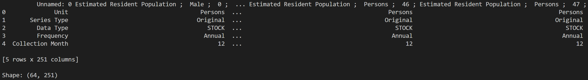
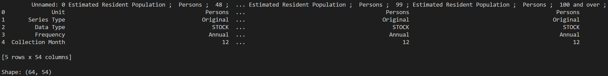

# Australian Population by Age (1971 - 2025)

## Overview

This project transforms raw population data (provided by the Australian Bureau of Statistics) into a clean, queryable PostgreSQL table.

The raw data was provided in a wide, Excel format and required significant restructuring before analysis.

## Pipeline

1. Raw XLSX files converted to CSV
2. Python (pandas) used to:
    - remove metadata rows
    - reshape wide to long format
    - extract sex and age dimensions
    - clean year and age values
3. Clean dataset saved as CSV
4. Data loaded into PostgreSQL
5. Analysis performed using SQL

## Data Validation

The raw dataset includes an unspecified sex category labelled "Persons", which appeared to represent combined population totals rather than a distinct demographic group.

To validate this interpretation, I manually cross-checked reported "Persons" population values against the sum of male and female population counts for selected age groups and years.

This validation step confirmed that the "Persons" values consistently matched the combined male and female totals, indicating that the category represents aggregated population counts rather than an additional sex category.

## Data Structure Transformation

### Raw Data (Wide Format)

The original ABS dataset was provided in a wide format and split into two separate sheets.
The dataset had age, sex, and metadata embedded in column names, resulting in over 300 columns across both sheets.

### Cleaned Data (Long Format)

The dataset has been reshaped into a clean, long format containing one element per row, allowing for the data to be easily filtered, grouped, or validated.

## Final Table Schema

population_by_age:

- year (INTEGER)
- sex (TEXT)
- age (INTEGER)
- population (INTEGER)

## Example Questions Answered

- How has the total population of Australia changed over time?
- What does the population pyramid look like of a given year?
- How has the 65+ population grown since 1971?

## Tools Used

- Python
- Pandas library
- PostgreSQL
- DBeaver

## My Portfolio

To browse the rest of my portfolio, follow the link below!

[Portfolio](https://github.com/JohnMartinMacLeod/data-portfolio)
